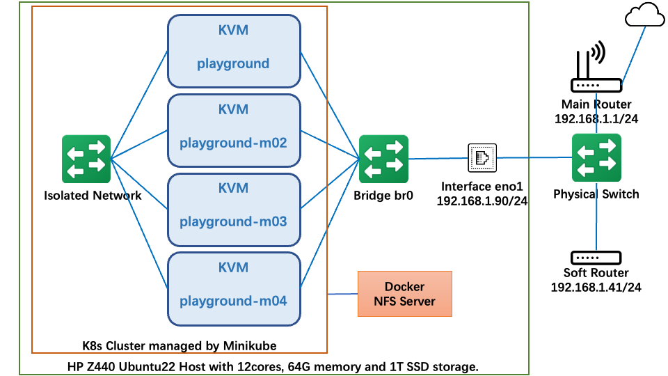

# k8s-playground
For building a multi-nodes k8s cluster environment with infra services.

Table Contents

- [k8s-playground](#k8s-playground)
  - [Architecture](#architecture)
  - [Prepare the Host Environment](#prepare-the-host-environment)
    - [Install Ubuntu](#install-ubuntu)
    - [Install KVM and Docker](#install-kvm-and-docker)
    - [Install Minikube and Helm](#install-minikube-and-helm)
    - [Config Network Environment](#config-network-environment)
  - [Create K8S Cluster](#create-k8s-cluster)
    - [Create Infra Standalone Services](#create-infra-standalone-services)
      - [Create NFS Server](#create-nfs-server)
    - [Start K8S Cluster](#start-k8s-cluster)
  - [Install Infra Service in K8S](#install-infra-service-in-k8s)
    - [Install `standard` Storage Class](#install-standard-storage-class)
  - [Docs](#docs)
    - [Access Services](#access-services)
    - [Change Data Capture Playground](#change-data-capture-playground)

## Architecture

The overall structure is shown in the figure below.



## Prepare the Host Environment

### Install Ubuntu

Install Ubuntu22 on HP Z440 Workstation and install common command.

Install common commands through apt.

```bash
sudo apt update
sudo apt install -y \
  htop iftop \
  vim \
  curl wget \
  make
```

Refer:

  * [Ubuntu Desktop Download Page](https://ubuntu.com/download/desktop)
  * [Ubuntu22.04 ISO Download Link](https://ubuntu.osuosl.org/releases/22.04.1/ubuntu-22.04.1-desktop-amd64.iso)

### Install KVM and Docker

Install KVM through apt command.

```bash
sudo apt -y install \
  bridge-utils \
  cpu-checker \
  libvirt-clients \
  libvirt-daemon \
  qemu \
  qemu-kvm
```

Install Docker through apt command. It is recommended to install according to the latest official website introduction.

```bash
sudo apt-get update
sudo apt-get -y install \
    ca-certificates \
    curl \
    gnupg \
    lsb-release
sudo mkdir -p /etc/apt/keyrings
curl -fsSL https://download.docker.com/linux/ubuntu/gpg | sudo gpg --dearmor -o /etc/apt/keyrings/docker.gpg
echo \
  "deb [arch=$(dpkg --print-architecture) signed-by=/etc/apt/keyrings/docker.gpg] https://download.docker.com/linux/ubuntu \
  $(lsb_release -cs) stable" | sudo tee /etc/apt/sources.list.d/docker.list > /dev/null
sudo apt-get update
sudo apt-get -y install \
  docker-ce docker-ce-cli \
  containerd.io \
  docker-compose-plugin
```

After installing docker, there is a quick way to allow a non-root user to use docker.

```bash
chown ${USER} /var/run/docker.sock
```

Refer:

  * [KVM Hypervisor: a Beginners’ Guide](https://ubuntu.com/blog/kvm-hyphervisor)
  * [Install Docker Engine on Ubuntu](https://docs.docker.com/engine/install/ubuntu/)

### Install Minikube and Helm

This repo uses a special version of minikube and helm.

Install Minikube:

```bash
curl -LO https://storage.googleapis.com/minikube/releases/v1.26.1/minikube-linux-amd64
sudo install minikube-linux-amd64 /usr/local/bin/minikube
rm minikube-linux-amd64
```

Install Helm:

```bash
curl -fsSL -o ./get_helm.sh https://raw.githubusercontent.com/helm/helm/main/scripts/get-helm-3
chmod 700 ./get_helm.sh
./get_helm.sh
rm ./get_helm.sh
```

Refer:

  * [Minikube Start](https://minikube.sigs.k8s.io/docs/start/)
  * [Installing Helm](https://helm.sh/docs/intro/install/)

### Config Network Environment

Config network environment, includes creating virtual bridge and kvm virtual network. They will be `bridge br0` as shown in the architecture diagram.

Create virtual bridge by netplan command. Pls check [network config file](configs/network/01-network-manager-all.yaml) first, and the default config will use a static ip which may not be right for you.

```bash
mv /etc/netplan/01-network-manager-all.yaml /etc/netplan/01-network-manager-all.yaml.backup
cp configs/network/01-network-manager-all.yaml /etc/netplan/01-network-manager-all.yaml
netplan apply
```

Create KVM virtual network.

```bash
virsh net-define configs/network/kvm-bridged-network.xml
virsh net-start bridged-network
virsh net-autostart bridged-network
virsh net-list
```
> Someday, the network is down in virtual machine, and the root cause is still unknown.

> You can also choose to use NAT mode.
> 
> *You cannot access specific network through changing route ip in nat mode*
> 
> ```bash
> virsh net-define configs/network/kvm-nat-network.xml
> virsh net-start nat-network
> virsh net-autostart nat-network
> virsh net-list
> ```

Refer:

  * [KVM: Creating a guest VM on a NAT network](https://fabianlee.org/2019/05/26/kvm-creating-a-guest-vm-on-a-nat-network/)
  * [KVM: Creating a bridged network with NetPlan on Ubuntu 18.04 bionic](https://fabianlee.org/2019/04/01/kvm-creating-a-bridged-network-with-netplan-on-ubuntu-bionic/)
  * [JINGTAO: PVE 网络瞎折腾](https://jingtao.fun/posts/c8fc0d41/)
  * [JINGTAO: 《Docker 容器与容器云》读书笔记 之 容器](https://jingtao.fun/posts/584611bc/)

## Create K8S Cluster

### Create Infra Standalone Services

It is need to create some infra to support k8s running well because this is a multi-nodes cluster.

#### Create NFS Server

Create NFS server through [bash script](scripts/infra_nfs_service_enable.sh), before running it, pls check `NFS_DOMAIN` variable which indicates the subnet that can access the NFS service.

### Start K8S Cluster

Now, It is all ready for starting k8s cluster! Start it through below command.
For setting route for k8s cluster, run `scripts/k8s_set_route.sh` script which will set route when node is ready.

```bash
PROFILE_NAME='playground'
SOFT_ROUTE_IP='192.168.1.41'
KVM_NETWORK='nat-network'
NODE_NUM=3
# bash ${WORKING_DIR}/scripts/k8s_set_route.sh ${PROFILE_NAME} ${NODE_NUM} ${SOFT_ROUTE_IP} &
# export HTTP_PROXY=http://${SOFT_ROUTE_IP}:1080
# export HTTPS_PROXY=https://${SOFT_ROUTE_IP}:1080
# export NO_PROXY=localhost,127.0.0.1,10.96.0.0/12,192.168.59.0/24,192.168.49.0/24,192.168.39.0/24
minikube config set WantUpdateNotification false
minikube \
  --profile ${PROFILE_NAME} \
  --driver=kvm2 \
  --install-addons=false \
  --kubernetes-version='v1.24.3' \
  --auto-update-drivers=false \
  --nodes=${NODE_NUM} \
  --cpus=8 \
  --memory=18g \
  --disk-size=40g \
  --kvm-network="${KVM_NETWORK}" \
  --image-mirror-country='cn' \
  --image-repository='registry.cn-hangzhou.aliyuncs.com/google_containers' \
  start
```

To get nodes:

```bash
PROFILE_NAME="playground"
minikube kubectl --profile ${PROFILE_NAME} -- get pods -A
```

To access dashboard:

```bash
PROFILE_NAME="playground"
minikube dashboard --profile ${PROFILE_NAME} --url
```

Refer to [k8s_start.sh](scripts/k8s_start.sh).

## Install Infra Service in K8S

Refer to [k8s_infra_services_enable.sh](scripts/k8s_infra_services_enable.sh) for all deploy code.

### Install `standard` Storage Class

Because this is a multi-nodes k8s, so the default storage class which using a certain host path can't satisfy the need. And the `standard` storage class can mount a nfs path which can be accessed by any node.

Deploy it using below command.

```bash
helm repo add nfs-subdir-external-provisioner https://kubernetes-sigs.github.io/nfs-subdir-external-provisioner
helm repo update
PROFILE_NAME="playground"
CONTEXT_NAME=${PROFILE_NAME}
NFS_STORAGE_NAMESPACE="storage-nfs"
IMAGE_MIRROR_SUFFIX=".registry.jingtao.fun"
# IMAGE_MIRROR_SUFFIX=""  # Leave blank to not apply mirror service
# get host ip
BR0_IP=$(ip addr show br0 | grep inet | grep -v 127.0.0.1 | grep -v inet6 | awk '{print $2}' | tr -d "addr:")
BR0_IP=$(echo ${BR0_IP//\// } | awk '{print $1}')
echo "your host ip: ${BR0_IP}"
minikube kubectl --profile ${PROFILE_NAME} -- create namespace ${NFS_STORAGE_NAMESPACE} --dry-run=client -o yaml | minikube kubectl --profile ${PROFILE_NAME} -- apply -f -
helm upgrade --install nfs-subdir-external-provisioner \
  --kube-context ${CONTEXT_NAME} \
  --namespace ${NFS_STORAGE_NAMESPACE} \
  --values configs/charts_values/nfs-values.yaml \
  --set nfs.server=${BR0_IP} \
  --set image.repository="k8s.gcr.io${IMAGE_MIRROR_SUFFIX}/sig-storage/nfs-subdir-external-provisioner" \
  --wait \
  --timeout 10m0s \
  nfs-subdir-external-provisioner/nfs-subdir-external-provisioner
```

## Docs

### [Access Services](./docs/access_to_infra_services.md)

### [Change Data Capture Playground](./resources/change_data_capture_playground/)

Refer:
  * [Kubernetes NFS Subdir External Provisioner](https://github.com/kubernetes-sigs/nfs-subdir-external-provisioner)

